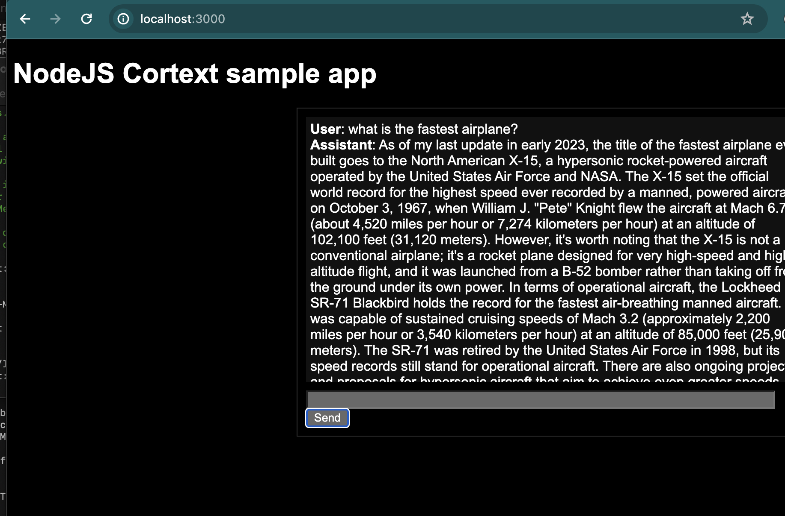

asdf
#NodeJS sample app

This app is a simple NodeJS chat application using Corcel's Cortext chat API.

To run, clone the repo, and install the dependencies

```
npm install dotenv express axios body-parser  
```

Create a .env file, and add your Corcel API key:

```
CORCEL_KEY=(your key here)
```

To start the server:
```
npm start
```

Now browse to localhost:3000 to start using the chat!


